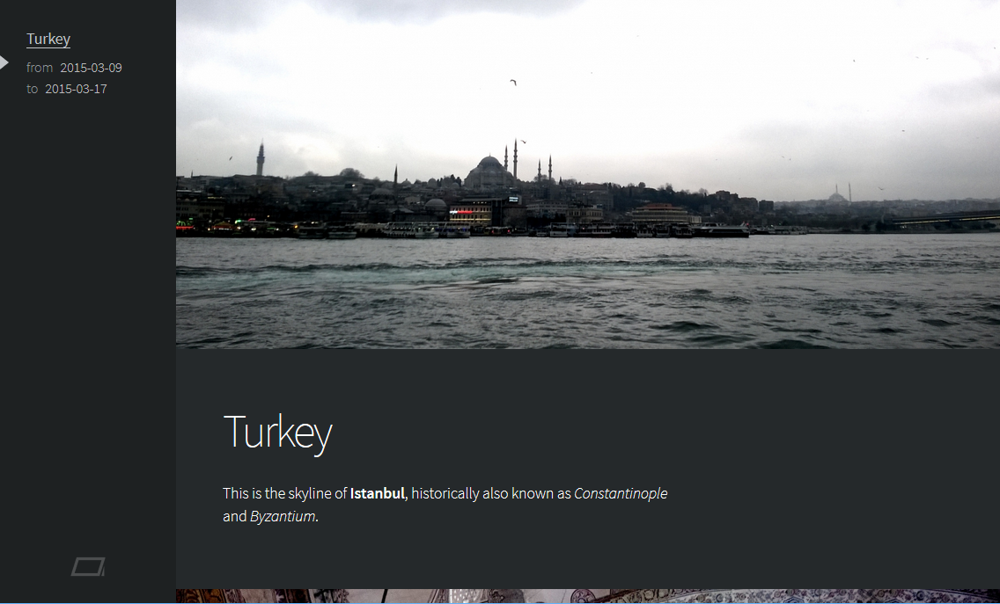

# Spirit

Just a beautiful, minimal, database-free photo journal in PHP. See Spirit at work [here](http://yichuanshen.de/photos).

## Getting Started

### Set Up

First, open the file `config-demo.php` and set your preferences. Save the file under `config.php`.

* `BASE_PATH`: The absolute path of the installation directory of Spirit.
* `IMG_SIZE`: The size of photos that will be displayed in the browser.
* `CACHE_DIR`: The relative path to the directory where the cache files are stored.
* `CONTENT_DIR`: The relative path to the directory where the albums and photos are stored.
* `ALLOW_DOWNLOAD`: Determines whether visitors are able to download the original photo files.

Create the cache and content directory as specified in `config.php`. Make sure to give the cache directory write permissions. Set up your web server to rewrite the URLs according to the rules in `.htaccess` if necessary.

### Journals & Photos

To create a journal, just create a directory in the content directory. The name will be present in the permalink of your journal. The journals will be sorted alphabetically. You can append a number with a hyphen to the directory name to determine the order yourself; Spirit will automatically remove the number from the permalink, e.g. journal directory `03-turkey` will get permalink `/turkey`.

To populate a journal with photos, just put the image files inside the journal directory. The photos will be sorted alphabetically.

Each photo can have an optional description. Just create a `.md` file named as the photo and put your description in there. You can use [Markdown](http://daringfireball.net/projects/markdown/syntax). For example, if you want to put a description beneath the photo `photo01.jpg`, just create a text file named `photo01.md` and put your description in there.

The journal won't appear in Spirit unless it has a title. To give your journal a title, just put a first level header in the first Markdown document in the journal directory. For example, to give your journal the title "Turkey", create a text file named after the first photo `photo01.md` starting with:

~~~
# Turkey
~~~

### Diashow

You can turn consecutive photos into a diashow. First, think of a unique diashow id. Then choose a selection of consecutive photos, say `photo02.jpg`, `photo03.jpg`, `photo04.jpg`. Just add `.{diashow id}` just before the file extension, e.g. `photo02.dia01.jpg`, `photo03.dia01.jpg`, `photo04.dia01.jpg`.

## Third Party Libraries

* [dispatcher](https://github.com/yishn/dispatcher) ([MIT License](https://github.com/yishn/dispatcher/blob/master/LICENSE))
* [Parsedown](http://parsedown.org/) ([MIT License](https://github.com/erusev/parsedown/blob/master/LICENSE.txt))
* [Thumb](https://github.com/jamiebicknell/Thumb) ([MIT License](https://github.com/jamiebicknell/Thumb/blob/master/LICENSE.md))
* [jQuery](http://jquery.com/) ([MIT License](https://jquery.org/license/))
* [Color Thief](https://github.com/lokesh/color-thief) ([MIT License](https://github.com/lokesh/color-thief/blob/master/LICENSE))
* [Source Sans Pro](http://adobe-fonts.github.io/source-sans-pro/) ([SIL Open Font License](https://github.com/adobe-fonts/source-sans-pro/blob/master/LICENSE.txt))
